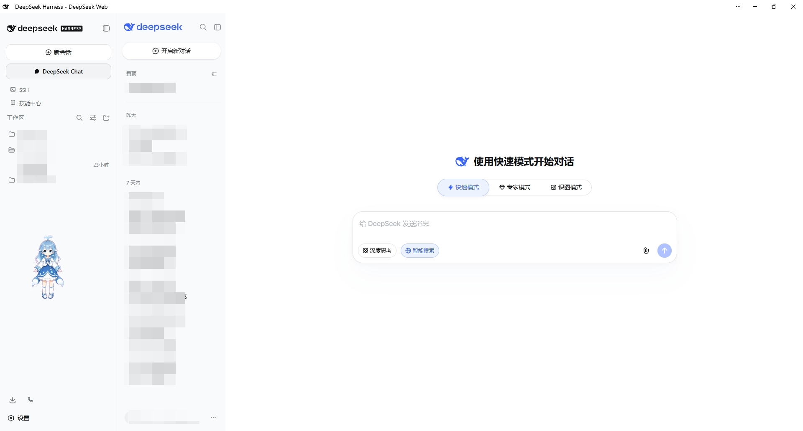
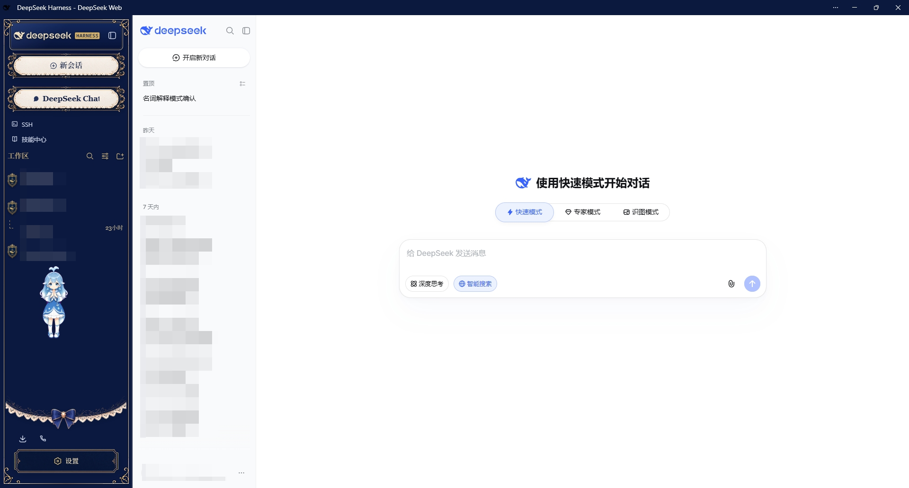

# dsh-web-dock

[](https://www.npmjs.com/package/dsh-web-dock)
[](https://github.com/CloudGamerMao/dsh-web-dock/blob/main/LICENSE)

> DSH 插件：将 Web 应用以停靠面板形式接入 DSH 界面（当前内置 DeepSeek Web）。通过**同源反向代理 + Service Worker** 将目标站点（chat.deepseek.com）内嵌到 DSH，支持就地登录、会话持久化与面板内聊天，架构可复用于 ChatGPT、Claude 等其他 Web 应用。

## 界面展示





## 功能特性

- **内嵌 DeepSeek Web 面板**：在 DSH 侧边栏「新会话」按钮下方新增「DeepSeek Chat」入口，点击即在主区域打开 DeepSeek Web 面板；面板为 body 级原生 DOM 元素，可绕过 React 重挂载，且与 DSH 原生视图行为一致（点击其他侧边栏项自动收起）。
- **同源反向代理**：宿主端提供 `/__dsweb-test/proxy` 反向代理 + 全域 Service Worker（`/__dsweb-test/sw.js`），将 iframe 内所有 `*.deepseek.com` 请求改写为同源请求，规避 iframe 跨域与混合内容限制。
- **就地登录**：在面板内直接完成 DeepSeek 账号登录，兼容邮箱密码与验证码（hCaptcha / AWS WAF / 数美 / Cloudflare Turnstile）。微信扫码登录已接入域名白名单与 Origin/Referer 重写，但**尚未完全打通**，见「已知问题与局限」。
- **会话持久化**：宿主端维护 cookie jar，DeepSeek 登录态持久化到磁盘（`~/.dsh/dsh-web-dock/session.json`），DSH 重启后无需重新登录；支持从真实浏览器导入 cookie（`/__dsweb-test/jar-import`）。
- **静态资源缓存**：对版本化静态资源（fe-static / cdn.deepseek.com）做内存 + 磁盘双层缓存并预取预热（`~/.dsh/dsh-web-dock/asset-cache/`），显著加快面板加载速度；首次启动缓存为空时首开略慢，加载完成后自动回填，后续秒开。
- **登录态自动同步**：检测到 `userToken` 等登录态写入后自动刷新 iframe，面板会话保持最新。
- **状态自检与诊断**：`/__dsweb-test/status` 提供 SW 版本、代理自检、域名白名单、会话数、请求统计、WAF 429、SPA 兜底重试、iframe 内 JS 错误等诊断信息，便于排障。
- **透明面板设计**：面板背景透明、入口按钮克隆 DSH 原生样式，尽量贴合 DSH 视觉；但第三方皮肤/主题插件**暂不兼容**，见「已知问题与局限」。

## 架构概览

```
DSH UI (127.0.0.1)
├─ lib/index.js  宿主端
│  ├─ /__dsweb-test/proxy       同源反向代理（域名白名单 + cookie jar + 资产缓存）
│  ├─ /__dsweb-test/sw.js       全域 Service Worker 脚本
│  ├─ /__dsweb-test/status      自检/诊断端点
│  ├─ /__dsweb-test/report      iframe 内 JS 错误收集
│  └─ /__dsweb-test/jar-import  cookie 手动导入
└─ lib/client.js  客户端（Web）
   ├─ 侧边栏入口按钮（克隆「新会话」样式，MutationObserver 保活）
   └─ 面板 iframe + 悬停控制条（刷新 / 状态 / 关闭）
        └─ Service Worker 拦截 *.deepseek.com 请求 → 同源代理 → upstream
```

## 安装

### 从 npm 安装（推荐）

```bash
dsh plugin --profile web add dsh-web-dock
```

安装完成后重启 DSH Web：

```bash
dsh web
```

> 本项目是 **DSH 插件**，请通过 `dsh plugin` 交给 DSH profile 管理，**不要**把 `npm install dsh-web-dock` 当作普通 Node.js 库的安装方式。

### 从 GitHub 安装（开发/测试）

```bash
dsh plugin --profile web add github:CloudGamerMao/dsh-web-dock
```

然后重启 DSH Web。

### Windows 便捷脚本（可选）

Windows 下 `dsh plugin add` 若被回收站 shim（`NODE_OPTIONS` 注入）拦截报 "Some operations were aborted"，可用项目内脚本绕过：

```bash
./scripts/dsh-plugin.sh plugin add dsh-web-dock --profile web
```

## 使用提示

- 客户端加载依赖 DSH Web Client 的 `@deepseek-ai/dsh-client-runtime`（见 `package.json` 的 `dsh.client.inject` 配置）。
- 面板入口位于侧边栏「新会话」按钮正下方；**首次打开若提示「首次使用请刷新一次页面」，刷新一次页面即可**（Service Worker 首次注册接管需一次刷新）。
- 脚本中硬编码的本机路径已移除，可通过环境变量 `DSH_BIN` / `DSH_NODE_BIN` 覆盖（默认从 npm 全局目录与 PATH 自动解析）。

## 安全模型

- `/__dsweb-test` 下所有路由仅接受**同源请求**（`isSameOrigin`），跨源调用一律 403。
- 代理目标受**严格白名单**约束：仅 `*.deepseek.com` 与登录依赖的验证码/微信 SDK 域名（`CAPTCHA_HOSTS`）可被代理，其余一律 403。
- 本项目**不绕过任何验证码**——仅使验证码 SDK 在 iframe 内可达，验证过程仍需用户手动完成。

## 已知问题与局限

- **首次打开需刷新一次页面**：Service Worker 注册存在竞态，首次打开面板可能提示刷新，刷新后即正常。
- **微信扫码登录暂未解决**：已对微信登录域名（`open.weixin.qq.com` / `*.weixin.qq.com` / `*.wx.qq.com`）做白名单放行与 Origin/Referer 重写，并内置调试记录（`wechatDebug`），但扫码登录链路（二维码渲染、状态轮询、登录态回传）尚未完全打通；当前请优先使用账号密码或验证码登录，微信扫码仅作实验性尝试。
- **与皮肤/主题插件不兼容**：面板与入口按钮基于 DSH 原生 DOM 结构注入，第三方皮肤/主题插件重绘或替换侧边栏 DOM 时，可能导致入口按钮丢失或面板显示异常，暂未适配。
- **依赖 DeepSeek 前端结构**：HTML 重写基于正则匹配 `<head>` 与静态资源标签，登录链路（DeepSeekHashV1 工作量证明、SRI、微信二维码等）随 DeepSeek 前端迭代需要持续适配。
- **验证码 SDK 域名白名单**：`CAPTCHA_HOSTS` 为静态维护，DeepSeek 更换/新增 SDK 域名时需要同步更新。
- **WAF 限流**：DeepSeek 服务端 WAF 可能对服务器出口 IP 限流（HTTP 429），面板提示「WAF 限流」，属上游限制而非代理缺陷。
- **会话明文存储**：cookie jar 以明文 JSON 存放于本机 `~/.dsh/` 目录，未加密，请勿在多用户共享机器上使用。
- **POC 定位**：项目为实验性质（`package.json` keywords 含 `poc`），存储格式与接口可能随版本演进而变化。
- **平台绑定**：`scripts/dsh-plugin.sh` 为 Windows 便捷脚本；客户端按钮/面板定位依赖 DSH 侧边栏 DOM 结构（如 `newSession` 等 class 名），DSH 界面改版时需同步适配。
- **iframe 逃逸**：若面板内页面发生跨域跳转离开代理页面，需点击面板悬停条「刷新」恢复。

## 欢迎社区拓展与贡献

本项目保持开放，欢迎任何形式的参与——Issue、PR 皆可。以下方向尤其欢迎：

- 扩展支持其他 Web 应用（如 ChatGPT、Claude 等）：本项目「同源代理 + Service Worker + 面板注入」是通用模式，可复用架构接入更多站点（需各自配置域名白名单、HTML 重写与登录链路适配）；
- 打通微信扫码登录（二维码渲染、状态轮询、登录态回传链路）；
- 适配第三方皮肤/主题插件（DOM 注入与重绘冲突、入口按钮与面板样式兼容）；
- 新增/更新验证码 SDK 与微信登录域名的白名单适配；
- 适配 DSH 界面改版（侧边栏 DOM、入口按钮样式）；
- 跨平台支持（macOS / Linux 的脚本与路径解析）；
- 会话 cookie 加密存储、多会话管理；
- 面板体验优化（快捷键、多开、窗口记忆等）。

请确保提交前代码通过基础语法检查，并在 PR 描述中说明改动动机与测试情况。

## License

[MIT](LICENSE) © 2026 [CloudGamerMao](https://github.com/CloudGamerMao)
